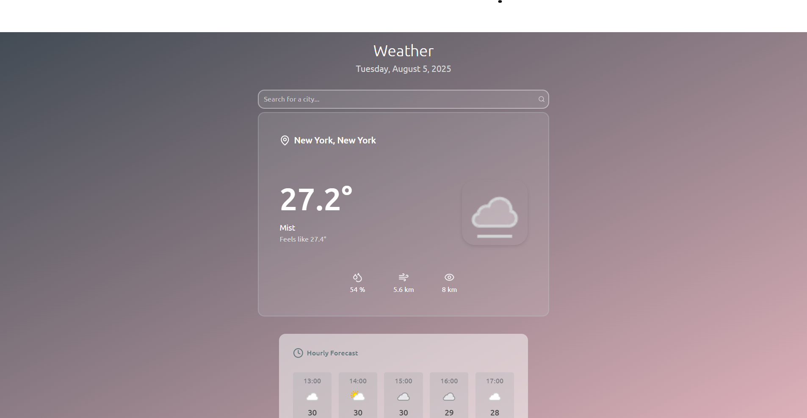

# ⛅️ Weather App - Learning Project




A simple, clean app that provides real-time weather forecasts, with a clean interface and location-based updates.

## ✨ Core Features
- City Weather Search
- Current Weather Display
- Hourly Forecast

## 🎯 Learning Goals
- API Integration
- HTTP requests with Axios
- Asynchronous JavaScript (async / await)
- External API consumption
- Animation Library (Anime.js)

## 🛠️ Built With
- Vue.js
- Vite
- HTML/CSS/JavaScript

## 📚 Libraries Used
- [Lucide Icon Library](https://lucide.dev/ "Lucide Icon Library")
- [Axios Promise Library](https://axios-http.com/ "Axios Promise Library")
- [AnimeJS Animation Library](https://animejs.com/ "AnimeJS Animation Library")

## 📦 Installation

### Prerequisites
- [Node.js](https://nodejs.org/) (version 16 or higher)
- npm or yarn package manager

### Steps
```bash
# Clone the repository
git clone https://github.com/trinidj/weather-app.git
cd weather-app
```

```bash
# Install dependencies
npm install
```

```bash
#Run Application
npm run dev
```